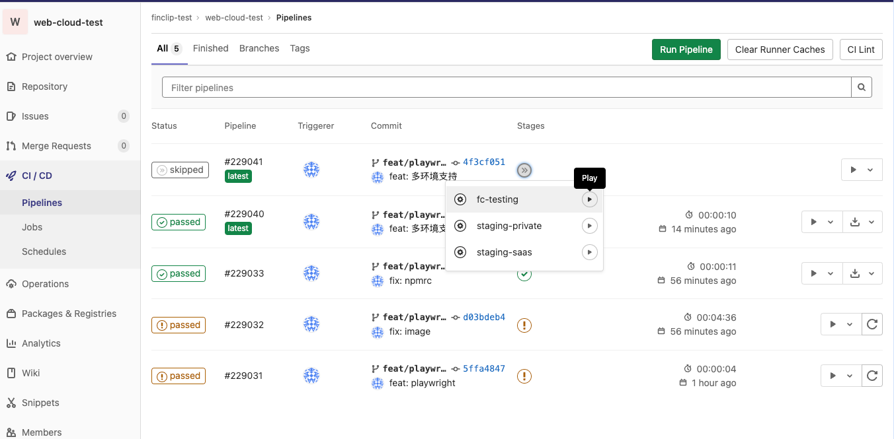

# FinClip Cloud Fe 自动化测试

使用 Playwright 实现的自动化测试框架，用于测试 FinClip Cloud 前端功能。

## 技术栈

- [Playwright](https://playwright.dev/) v1.49.1 - 现代化的自动化测试框架
- TypeScript - 类型安全的 JavaScript 超集
- Node.js - JavaScript 运行时

## 快速开始

### 环境准备

1. 安装依赖
```bash
npm install
```

2. 安装浏览器
```bash
npx playwright install
```

### 运行测试

1. 本地运行所有测试
```bash
npm run test
```

2. UI 模式运行（推荐用于开发和调试）
```bash
npm run test:ui
```

3. 运行特定测试文件
```bash
npm run test tests/dev/login.spec.ts
```

### CI 环境

在 gitlab 的 CI/CD 中选择对应的分支和环境开始。测试结果在 CI 的产物中，有效期 7 天。



## 项目结构

```
├── config/                 # 配置文件
│   ├── environments.json   # 环境配置
│   └── testData.json      # 测试数据
├── pages/                  # 页面对象
│   └── basePage.ts        # 基础页面类
├── tests/                  # 测试用例
│   ├── dev/               # 开发者中心测试
│   └── ops/               # 运营中心测试
├── utils/                  # 工具类
│   └── ConfigManager.ts   # 配置管理器
└── playwright.config.ts    # Playwright 配置
```

## 配置管理

### 环境配置 (environments.json)

用于管理不同环境的配置信息，如 BASE_URL、账号密码等。

```json
{
  "FC_TESTING": {
    "BASE_URL": "https://fc-testing.example.com",
    "DEV_USER_ACCOUNT": ["username", "password"]
  }
}
```

### 测试数据 (testData.json)

用于存储测试用例中需要的测试数据。

```json
{
  "appId": "fc2326599079399045",
  "appName": "测试demo1"
}
```

### 使用 ConfigManager

1. 获取环境配置
```typescript
import { ConfigManager } from '../utils/ConfigManager';

const config = ConfigManager.getInstance();
const baseUrl = config.get('BASE_URL');
```

2. 获取测试数据
```typescript
const config = ConfigManager.getInstance();

// 获取单个值
const appId = config.getTestData('appId');       // 返回 "fc2326599079399045"
const appName = config.getTestData('appName');   // 返回 "测试demo1"

// 在测试用例中使用
test('搜索小程序 AppID', async ({ page }) => {
    const appId = config.getTestData('appId');
    await page.getByPlaceholder('请输入小程序ID').fill(appId);
});
```

## 编写测试用例

### 使用 BasePage

BasePage 类提供了通用的页面操作方法，简化了测试用例的编写。

1. 基本用法
```typescript
import { test } from '@playwright/test';
import { BasePage } from '../../pages/basePage';

test('示例测试', async ({ page }) => {
    const basePage = new BasePage(page);
    
    // 打开页面并使用指定账号登录。如果只需要打开页面不登录，不能用这个方法，直接用page.goto
    await basePage.goto('/dev#/miniApp/index', 'pengzq1');
    

});
```

2. 配置管理
- 账号配置在 `config/environments.json` 中
- 支持多环境配置：FC_TESTING、STAGING_SAAS、STAGING_PRIVATE
- 可以通过环境变量 TEST_TARGET 指定测试环境,默认环境是FC_TESTING

3. 最佳实践
```typescript
test.describe('测试套件', () => {
    let basePage: BasePage;
    const config = ConfigManager.getInstance();

    // 在每个测试用例前初始化
    test.beforeEach(async ({ page }) => {
        basePage = new BasePage(page);
    });

    test('测试用例', async ({ page }) => {
        // 使用指定账号登录
        await basePage.goto('/dev#/miniApp/index', 'pengzq');
        
        // 等待页面加载
        await page.waitForTimeout(2000);
        
        // 执行测试步骤...
    });
});
```

### 常用断言

```typescript
// 元素可见性
await expect(page.getByTestId('element-id')).toBeVisible();

// 文本内容
await expect(page.getByText('期望的文本')).toBeVisible();
await expect(element).toContainText('部分文本');

// 元素属性
await expect(element).toHaveAttribute('class', 'expected-class');
await expect(inputElement).toHaveValue('期望的值');

// 元素状态
await expect(button).toBeEnabled();
await expect(checkbox).toBeChecked();

// 元素数量
await expect(page.getByTestId('list-item')).toHaveCount(5);
```

### 常用选择器

```typescript
// 通过 data-testid（推荐）
page.getByTestId('element-id')

// 通过文本
page.getByText('按钮文本')

// 通过角色
page.getByRole('button', { name: '搜索' })

// 通过占位符
page.getByPlaceholder('请输入...')

// 通过标签
page.getByLabel('用户名')
```

## 录制测试用例

### 开始录制

```bash
npx playwright codegen fc-testing.finogeeks.club
```

### 录制建议

1. 使用 data-testid 定位元素
   - 在前端代码中添加 data-testid 属性
   - 使用有意义的 ID，如 `user-list-item-${index}`

2. 优先使用语义化的选择器
   - 按钮文本
   - 占位符文本
   - ARIA 标签

3. 等待策略
   - 网络请求：`await page.waitForLoadState('networkidle')`
   - 元素可见：`await element.waitFor({ state: 'visible' })`
   - 元素消失：`await element.waitFor({ state: 'hidden' })`

4. 删除冗余代码
   - 移除不必要的等待
   - 合并重复的操作
   - 使用更简洁的选择器

### 调试技巧

1. UI 调试
```bash
npm run test:ui
```

2. 代码调试
```typescript
// 暂停执行
await page.pause();

// 保存截图
await page.screenshot({ path: 'debug.png', fullPage: true });

// 打印页面内容
console.log(await page.content());
```

3. 使用 Trace Viewer
```typescript
// 在 test.describe 中启用
test.use({ trace: 'on-first-retry' });
```

4. 代码组织
- 使用 `test.describe()` 组织相关测试
- 使用 `test.beforeEach()` 设置公共前置条件
- 使用 `test.afterEach()` 清理测试状态

## 常见问题

1. 元素无法找到
- 检查选择器是否正确
- 确认元素是否在页面中渲染
- 尝试增加等待时间

2. 测试不稳定
- 添加适当的等待条件
- 使用更可靠的选择器
- 检查网络请求状态

3. 配置问题
- 确认环境变量设置正确
- 检查 environments.json 配置
- 验证账号权限

## 贡献指南

1. 创建新测试
- 遵循现有的目录结构
- 使用有意义的文件名和测试描述
- 添加必要的注释

2. 代码风格
- 使用 TypeScript
- 遵循项目的代码规范
- 保持代码简洁清晰

3. 提交代码
- 编写清晰的提交信息
- 确保所有测试通过
- 更新相关文档

## 参考资料

- [Playwright 官方文档](https://playwright.dev/docs/intro)
- [TypeScript 文档](https://www.typescriptlang.org/docs/)
- [测试最佳实践](https://playwright.dev/docs/best-practices)
